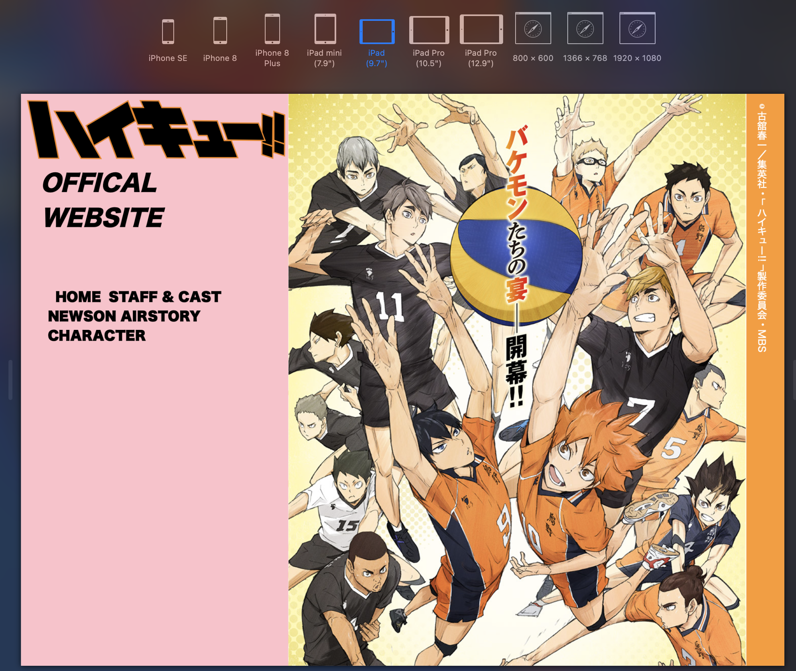

# Procesverslag
Markdown is een simpele manier om HTML te schrijven.  
Markdown cheat cheet: [Hulp bij het schrijven van Markdown](https://github.com/adam-p/markdown-here/wiki/Markdown-Cheatsheet).

Nb. De standaardstructuur en de spartaanse opmaak van de README.md zijn helemaal prima. Het gaat om de inhoud van je procesverslag. Besteedt de tijd voor pracht en praal aan je website.

Nb. Door *open* toe te voegen aan een *details* element kun je deze standaard open zetten. Fijn om dat steeds voor de relevante stuk(ken) te doen.

## Jij

uitwerken voor kick-off werkgroep

### Auteur:
Klaudija Miskovic

#### Je startniveau:
Rood

#### Je focus:
Responsive
 

## Je website

uitwerken voor kick-off werkgroep

### Je opdracht:
https://haikyu.jp
 
#### Screenshot(s) van de eerste pagina (small screen):
Homepage  

 
 #### Screenshot(s) van de tweede pagina (small screen):
Cast pagina   

 
 

## Breakdownschets (week 1)

uitwerken na afloop 2e werkgroep

### de hele pagina: 

### NEWS: 

### Staff en cast: 

 
 ### Menu: 

## Voortgang 1 (week 2)

uitwerken voor 1e voortgang

### Stand van zaken
Het is mij voor de voortgang gesprek gelukt om beide paginas in volle HTML en CSS te maken, en heb ik er een een beetje Javascript aan toegevoegd. Waar ik zelf het trotst op ben is hoe ik de hamburger menu heb gemaakt en de Cast & Staff pagina. 

   
 

### Agenda voor meeting
samen met je groepje opstellen

| Artinjo      | Huib          | Klaudija    | Robin        |
| ---          | ---                | ---          | ---              |
| -Navigatie, hamburger menu   |   Had op dit moment niet iets om te bespreken    | Had op dit moment niet iets om te bespreken   | -   |
| | - |  | - |
| ...         | ...                | ...          | ...              |

### Verslag van meeting
hier na afloop snel de uitkomsten van de meeting vastleggen

- De div om de class="hamburger' te vervagen door een <button.
- Om de logo een h1 plaatsen
- nog een punt
- In de table. ipv een span te gebruiken, de eerste td vervangen door een th
- De classes in de section weghalen
- Van de main IMG op de homepagina, de tekst met html schrijven ipv een foto.                                                             

## Voortgang 2 (week 3)

uitwerken voor 2e voortgang

### Stand van zaken
Eerder heb ik nog nooit met grid gewerkt, dus dit was mijn eerste keer. Het was wel even wennen en opzich snap ik de basis wel maar ik moet er meer mee oefenen om het beter te kunnen snappen. Op dit moment ben ik bezig met het responsive maken van mijn website. Als het goed is is die al wel responsive t/m een ipad (staand) formaat, maar vanaf ipad liggend formaat t/m desktop moet ik er nog mee aan de slag. 
 
     

### Agenda voor meeting
samen met je groepje opstellen

| Huib    | Artinjo         | Klaudija  | student 4        |
| ---            | ---                | ---          | ---              |
| Responsive maken en mooi houden tegerlijkertijd  | Afbeeldingen met grid positioneren   | Tips voor het responsive maken voor desktop  | en dan ik dat    |
| Footer afbeelding | |  | dit wil ik zeker |
| ...            | ...                | ...          | ...              |

### Verslag van meeting
hier na afloop snel de uitkomsten van de meeting vastleggen

- Het probleem van Huis is opgelost. De afbeelding op de footer die spring eruit waardoor de pagina ook een stuk extra space van kreeg. 
- Artinjo is ook geholpen met zijn probleem.
- Voor mij is het nu duidelijk hoe ik de font-sizes zou kunnen aanpassen mbv media query.
- We kregen wat tips en tricks wat handig zijn. En een paar plug-ins voor SVC

## Toegankelijkheidstest (week 4)

uitwerken na test in 8e voortgang

### Bevindingen
Lijst met je bevindingen die in de test naar voren kwamen:

#### Screenreader
Hier korte omschrijving (met indien nodig een afbeelding)
 Ik heb de screenreader op mijn telefoon geprobeerd en opzich lukte het mij wel om ermee om te gaan. Er kwamen natuurlijk wel een paar dingen naar voren 

Hier een omschrijving van hoe het opgelost kan worden (met indien nodig een afbeelding)

#### Spasme/motoriek
 Zelf heb ik ook de elektrische stimulator gebruikt en snel kwam ik erachter dat het best lastig was om door je site heen te scrollen. Het scrollen ging niet zo heel smooth want ik had niet zo heel veel controle over mijn arm. Zolang de buttons wat groter waren kon ik er nog wel op klikken.

Voor het oplossen van een button probleem is het bests simpel. Door de buttons wat groter te maken, zodat er meer ruimte is om erop te kunnen klikken.

#### Low contrast
 Voor de low contrast heb ik het voor zowel mijn desktop versie als mijn mobiele versie getest omdat er wat verschillen zitten op de inertface. Voor desktop viel de footer niet zo op, met name wit tekst op een oranje achtegrond. De H2 van de twitter section is wel te zien maar niet goed te lezen. 
 Nou voor de mobiele versie viel de menu button niet zo heel erg op. In de table was weer hetelfde probleem als in de footer, wit op oranje is niet zo goed te lezen. 

Voor de footer en de table probleem, kan het opgelost worden door de achtergrond wat lichter te maken en de tekst wat donkerder, of gewoon de tekst een donkere leur geven. Voor de H2 van de twitter section kan dit opgelost worden door er een weight toe te voegen en een wat donkere kleur. 
 Een oplossing voor de menubutton kan zijn is door het een wat donkere kleur te geven, zodat het wat mee opvalt.
 

#### Peripheral field loss 
 Ook hier heb ik voor zowel mobiel als desktop getest. Hier kwam uit dat het nog wel te lezen en te zien was zolang je maar goed concetreert op wat op het scherm staat. Zodra je er even snel langs kijkt, kan je al niet zog goed lezen wat er precies staat. Dankzij de zwarte tekst op een wit achtergrond was dit wel goed te lezen. Maar hoe kleiner de tekst is hoe moeilijker het ook was om het te kunnen lezen. 

 Dit kan makkelijk opgelost worden door de font-size groter te maken. 
 
 #### Kleurenblind 
Het testen met de kleuren blind bril ging best wel goed, alles was wel prima te zien op zowel desktop als mobiele scherm. 

## Voortgang 3 (week 4)

uitwerken voor 3e voortgang

### Stand van zaken
hier dit ging goed & dit was lastig (neem ook screenshots op van delen van je website en code)

### Agenda voor meeting
samen met je groepje opstellen

| student 1      | student 2          | student 3    | student 4        |
| ---            | ---                | ---          | ---              |
| dit bespreken  | en dit             | en ik dit    | en dan ik dat    |
| en dat ook nog | dit als er tijd is | nog een punt | dit wil ik zeker |
| ...            | ...                | ...          | ...              |

### Verslag van meeting
hier na afloop snel de uitkomsten van de meeting vastleggen

- punt 1
- punt 2
- nog een punt
- ...

## Eindgesprek (week 5)

uitwerken voor eindgesprek

### Stand van zaken
hier dit ging goed & dit was lastig (neem ook screenshots op van delen van je website en code)

### Screenshot(s)

hier screenshot(s) van je eindresultaat

## Bronnenlijst

continu bijhouden terwijl je werkt

Nb. Wees specifiek ('css-tricks' als bron is bijv. niet specifiek genoeg).

1. Scroll to top button : https://www.w3schools.com/howto/tryit.asp?filename=tryhow_js_scroll_to_top & https://html-online.com/articles/dynamic-scroll-back-top-page-button-javascript/ 
2. Icon voor de hamburger menu: https://www.w3schools.com/howto/howto_css_menu_icon.asp
3. Iframe responsive https://blog.theodo.com/2018/01/responsive-iframes-css-trick/

